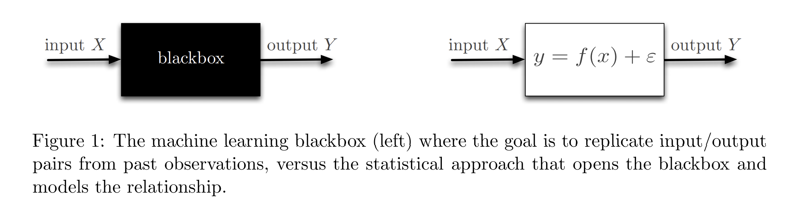

# 统计学习理论
## 一、介绍
统计学习理论(statistical learning theory)属于机器学习和统计交叉的领域，机器学习和统计都一个共同的目标，即**通过数据来改善决策**。相对于机器学习不到百年的发展历史，
统计的根基要厚重得多，最早可以追溯到250年前得Bayes，统计在19世纪20年代就成为了一个完备的学科，Fisher发明了统计推断(statistical inference)的系统性工具———最大似然估计(MLE)。
然而最大似然估计需要我们知道数据的分布族，也就是需要对数据产生过程有一定的了解，而对数据产生过程的假设就称为建模(Modeling)。然而现实生活中，我们对很多输入输出过程并不了解，
比如图像分类，并不需要理解给图像贴标签的过程，而是去**复现**观测到的数据对，从这个角度上说，机器学习为了解决更复杂的Modeling问题而更偏爱黑箱方法(blackbox approach)。

统计学习理论是机器学习中非常多判别式模型的根基，比如神经网络、深度学习等等，它主要关注采样复杂度问题(sample complexity questions)，本仓库主要参考MIT 18.657 Mathematics of Machine Learning
的[讲义](reference/MIT+Mathematical+in+ML.pdf)，在自学过程中进行总结和分享。

## 二、参考资料
[1] [MIT Course 18.657 Prof. Philippe Rigollet](https://ocw.mit.edu/courses/mathematics/18-657-mathematics-of-machine-learning-fall-2015/)

